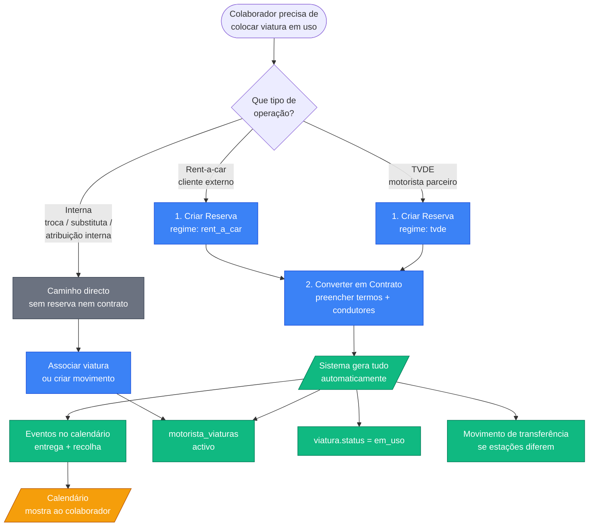
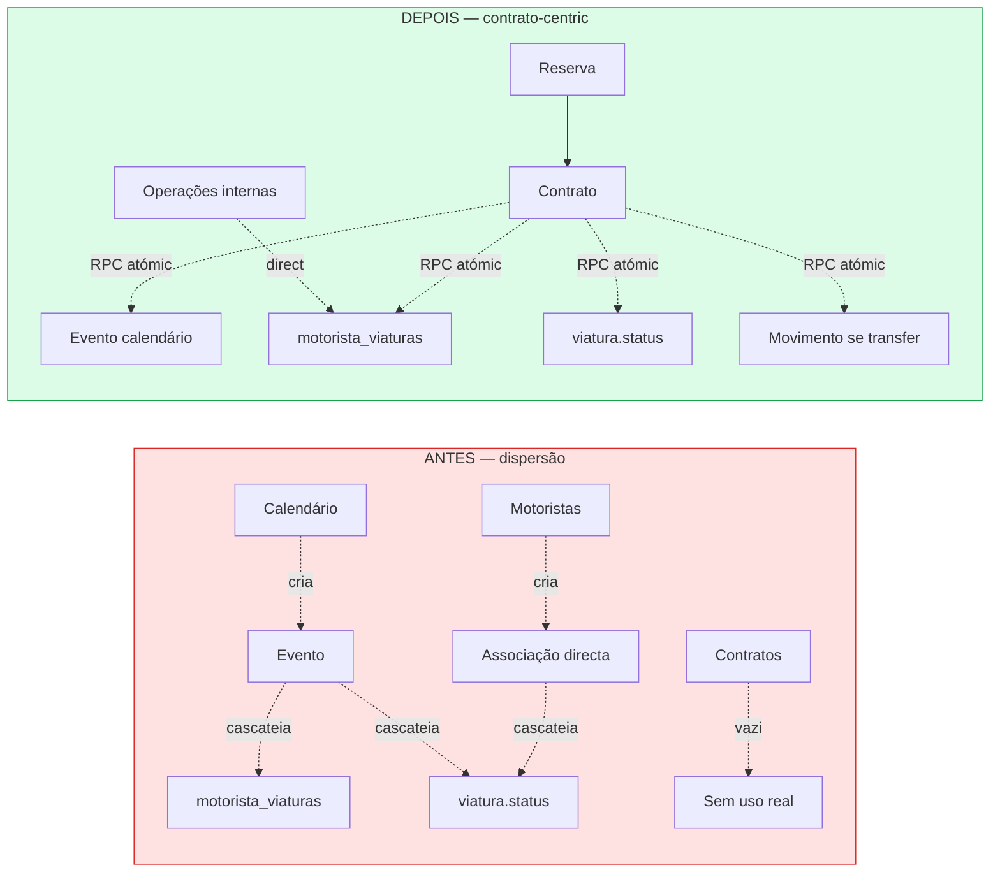
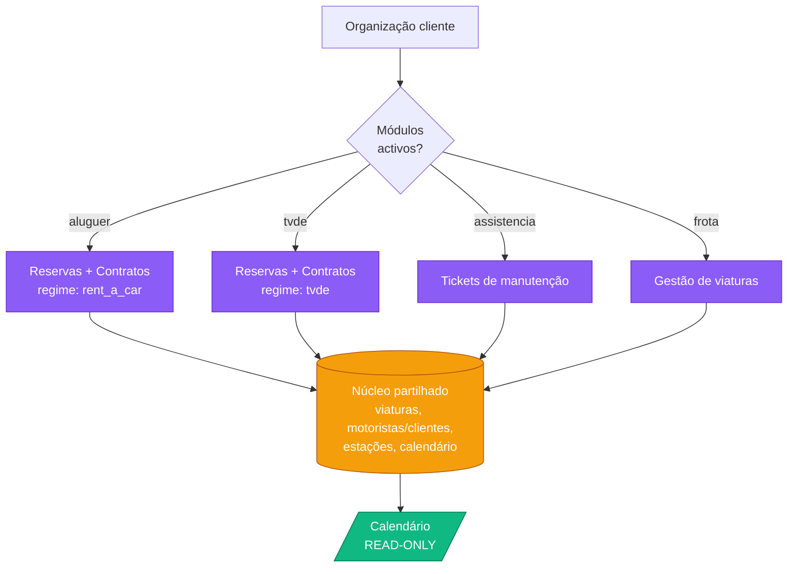

# Fase 2 — Plano de Acção: Contrato-Centric

> **Objectivo:** pôr o contrato em uso pela primeira vez como fonte de verdade da operação. Calendário passa a ser leitor. Movimentos ficam para operações internas. Suporta `regime` TVDE e rent-a-car partilhando frota.
>
> **Estado:** em planeamento. Fases 0 (refactor tickets) e 1 (módulos comerciais + fundações) concluídas.

---

## 1. Resumo executivo

O sistema gira hoje em torno do **calendário** (legado de quando não havia contratos). Os colaboradores trabalham em **motoristas + viaturas** e criam eventos no calendário para entregar/recolher viaturas. O módulo de **contratos** existe na BD e tem formulário completo, mas **ninguém o usa** — está em desenvolvimento.

A Fase 2 inverte isto: **o contrato passa a ser fonte**, criado a partir de uma **reserva obrigatória**. Cria contrato → gera automaticamente evento no calendário, atribuição motorista↔viatura, movimento de transferência se estações diferem, e actualização do estado da viatura. Calendário deixa de ser editável — fica como vista temporal.

Operações **internas** (troca, substituta, atribuição interna sem cliente) continuam fora do fluxo contrato — usam apenas `motorista_viaturas` e `movimentos`.

---

## 2. Decisões arquiteturais (todas aprovadas)

1. **Reserva → Contrato é passo obrigatório** para TVDE e rent-a-car formais.
2. **Operações internas** (troca, substituta, manutenção) **não** geram contrato — só `motorista_viaturas` ou `movimento`.
3. **Calendário read-only** — escrito apenas por sistema (triggers/hooks) a partir de contratos, movimentos e datas de viatura (inspecção, vencimentos).
4. **Modelo dual frota partilhada** — uma viatura pode estar em TVDE este mês e rent-a-car no próximo. Estado canónico em `viaturas.status`.
5. **Módulos comerciais** (Fase 1 já implementada): `aluguer`, `tvde`, `assistencia`, `frota` activáveis por organização. Vocabulário pode adaptar-se via [useLabel](../../src/hooks/useLabel.ts).
6. **`regime`** vive em `contratos.regime` (`'rent_a_car' | 'tvde'`) — não em `motoristas` nem em `viaturas`.

---

## 3. Diagramas

### 3.1 — Fluxo do colaborador

### 3.2 — Antes vs Depois

### 3.3 — Arquitectura SaaS com módulos

---

## 4. Estado actual (das auditorias)

### 4.1 Reserva — **mais pronta do que o contrato**

- ✅ CRUD ponta-a-ponta, 4 tabs (Geral, Condutores, Caixa, Anexos)
- ✅ Validação Zod com regras condicionais
- ✅ Botão "Criar Contrato" em [RentingReservaForm.tsx:322-336](../../src/pages/renting/RentingReservaForm.tsx#L322) que passa `reserva_id` ao contrato
- ✅ Selector no contrato filtra reservas confirmadas/sem contrato — [ContratoSelectorReserva.tsx:32-66](../../src/components/renting/contratos/ContratoSelectorReserva.tsx#L32)
- ✅ `EXCLUDE` constraint na BD bloqueia overbooking
- ✅ Campo `modalidade` (rent_a_car/tvde) — paridade com contrato

**Gaps:**
- Tarifa é placeholder ([ReservaTabGeral.tsx:491-503](../../src/components/renting/reservas/tabs/ReservaTabGeral.tsx#L491)) — colaborador insere `valor_total` manualmente
- Estado da reserva não avança ao criar contrato — fica em "confirmada" para sempre
- Sem atalhos de criação de reserva (a partir de motorista/viatura/calendário)

### 4.2 Contrato — **muito mais avançado do que esperado**

- ✅ 6 tabs completas (Geral, Condutores, Coberturas, Extras, Taxas, Anexos)
- ✅ CRUD com filtros, sort, pesquisa, export CSV
- ✅ Validação Zod ambos os regimes
- ✅ Conflito de viatura detectado pré-gravação
- ✅ Sync de relações (condutores, coberturas, extras com `dias`, taxas com `subtotal`)

**Bloqueadores:**
- ⛔ **`onSubmit` não chama** RPC `gerar_contrato_atomico` que existe em [useContratos.ts:36](../../src/hooks/useContratos.ts#L36) — usa mutations separadas. **Contrato fica órfão** (sem evento de calendário, sem `motorista_viaturas`, sem update de `viatura.status`).
- ⛔ `regime` só muda IVA ([ContratoForm.tsx:278-284](../../src/pages/renting/ContratoForm.tsx#L278)) — campos visíveis e lógica são iguais para TVDE e rent-a-car. **Falta bifurcação UX**.
- ⛔ Reserva obrigatória ([ContratoForm.tsx:119-123](../../src/pages/renting/ContratoForm.tsx#L119)) — decidido manter, mas implica que Fase 2b (atalhos) é crítica.

---

## 5. Plano por sub-fase

### Sub-fase 2a — Acabar formulário de contrato

**Objectivo:** quando colaborador grava contrato, tudo cascateia automaticamente.

**Tarefas:**
- [ ] Integrar RPC `gerar_contrato_atomico` no `onSubmit` de [ContratoForm.tsx:308-403](../../src/pages/renting/ContratoForm.tsx#L308) (substitui o create directo)
- [ ] Verificar/completar parâmetros da RPC: `calendario_evento_id`, `motorista_viatura_id`, status da viatura, movimento de transferência
- [ ] Bifurcação visual por `regime`:
  - **TVDE:** "cliente" rotulado como "Motorista parceiro" (via `useLabel('cliente.singular')` já existente); campos específicos TVDE se aplicável
  - **Rent-a-car:** mantém "Cliente"; campos completos
- [ ] Trigger/hook que faz `reserva.estado = 'em_curso'` quando se cria contrato (resolve gap #2 da Reserva)
- [ ] Toast pós-create mostra número do contrato gerado

**Critério de feito:** Criar contrato pelo formulário gera **simultaneamente** contrato + evento de calendário + `motorista_viaturas` activo + `viatura.status='em_uso'` + (opcional) movimento de transferência. Reserva fica em `em_curso`.

**Ficheiros a tocar:**
- [src/pages/renting/ContratoForm.tsx](../../src/pages/renting/ContratoForm.tsx)
- [src/hooks/useContratos.ts](../../src/hooks/useContratos.ts) (já tem a RPC)
- [src/hooks/useReservas.ts](../../src/hooks/useReservas.ts) (transição de estado)
- Possível alteração da RPC `gerar_contrato_atomico` em SQL

---

### Sub-fase 2b — Atalhos de criação

**Objectivo:** reduzir fricção. Colaborador não tem de ir ao menu `/renting/reservas`.

**Tarefas:**
- [ ] Botão "Nova reserva com esta viatura" em [ViaturaDetalhe.tsx](../../src/pages/ViaturaDetalhe.tsx) → pré-popula `viatura_id`
- [ ] Botão "Nova reserva com este motorista" em [MotoristaDetalhe.tsx](../../src/pages/MotoristaDetalhe.tsx) → pré-popula `condutor_id` ou cria/usa `cliente` ligado
- [ ] Clique em data vazia no calendário → abre dialog "Nova reserva nesta data"
- [ ] Em [MotoristaTabViaturas.tsx](../../src/components/motoristas/tabs/MotoristaTabViaturas.tsx): renomear "Associar Viatura" para **"Atribuição interna"** com tooltip a explicar que não cria contrato. Adicionar segundo botão **"Criar reserva → contrato"** que abre o fluxo formal.

**Critério de feito:** Em ≤2 cliques a partir do motorista/viatura/calendário, o colaborador chega ao formulário de Reserva pré-preenchido.

---

### Sub-fase 2c — Calendário lê de contratos/movimentos

**Objectivo:** eventos no calendário aparecem por consequência de outras entidades. UI de criação manual de evento contratual desactivada.

**Tarefas:**
- [ ] Quando RPC `gerar_contrato_atomico` corre: criar 2 eventos (`entrega` em `data_inicio`, `recolha` em `data_fim`) — provavelmente já cria 1, garantir 2
- [ ] Quando movimento é criado: gerar evento correspondente (`transferencia` / `manutencao` / `inspecao` / `impro`) via trigger SQL ou hook
- [ ] Datas da viatura (`data_proxima_inspecao`, vencimentos de seguros/IUC) → eventos derivados (decidir: trigger ou view)
- [ ] Coluna `origem_tipo` + `origem_id` em `calendario_eventos` para audit (de onde veio cada evento)
- [ ] Em [NovoEventoPage.tsx](../../src/components/calendario/NovoEventoPage.tsx): desactivar criação manual de tipos contratuais (`entrega`, `recolha`, `troca`, `devolucao`). Mostrar mensagem "Eventos de contrato são gerados automaticamente".

**Critério de feito:** Ao criar contrato, eventos aparecem no calendário sem intervenção manual. UI de "Novo Evento" não permite criar tipos contratuais.

---

### Sub-fase 2d — Limpeza e polish

**Objectivo:** fechar pontas.

**Tarefas:**
- [ ] Remover/esconder UI de criação manual de evento no calendário para tipos contratuais
- [ ] Documentar máquina de estados do contrato (à semelhança do que já fizemos para viatura em [docs/architecture/viatura-estados.md](./viatura-estados.md))
- [ ] Smoke test em produção (org actual, sem afectar dados reais — usar viatura de teste)
- [ ] Treino curto aos colaboradores (1 página com print screens)

---

## 6. Riscos e mitigações

| Risco | Probabilidade | Mitigação |
|---|---|---|
| Colaboradores resistem ao fluxo Reserva→Contrato | Alta | Atalhos da Fase 2b são críticos. Treino + acompanhamento na 1ª semana. |
| RPC `gerar_contrato_atomico` tem bugs latentes (nunca foi exercida com tráfego real) | Média | Smoke test extensivo na sub-fase 2a antes de Fase 2c. |
| Trigger SQL de evento de calendário causa loops | Baixa | Triggers `AFTER` com condições explícitas. Já temos padrão em [movimento_sync_viatura](../../supabase/migrations/20260520000001_create_movimentos.sql). |
| Mudança parte fluxos existentes | Alta | Operação actual (motorista + calendário) **continua a funcionar** durante 2a + 2b. Só na 2c se desactiva a criação manual. |

---

## 7. Ordem de execução recomendada

1. **2a** primeiro — sem isto nada cascateia. ~3-5 dias de trabalho.
2. **2b** em paralelo (pode arrancar quando 2a estiver com RPC integrada). ~2 dias.
3. **2c** depois de 2a estar testado em produção. ~3 dias.
4. **2d** contínuo, fecha quando os 3 anteriores estiverem estáveis.

**Estimativa total:** ~10 dias úteis para 1 dev. Dobra para revisão+QA realista. **Não comecem a sub-fase seguinte enquanto a anterior não estiver em produção e estável.**

---

_Criado em 2026-05-26 · Fase 2 (Contrato-centric)_
_Decisões registadas em [project_saas_modulos](../../C:/Users/Utilizador/.claude/projects/c--Users-Utilizador-Documents-GitHub-WeGest/memory/project_saas_modulos.md) e [project_calendario_readonly](../../C:/Users/Utilizador/.claude/projects/c--Users-Utilizador-Documents-GitHub-WeGest/memory/project_calendario_readonly.md)_
